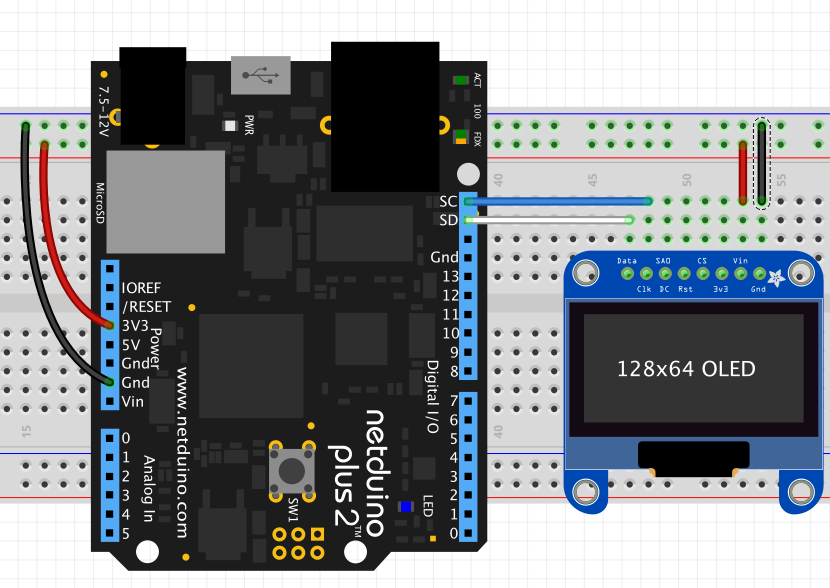

# SSD1306 - Hardware Driver for SSD1306 Family of Displays

OLED displays based upon the SSD1306 chip set are small, high contract display.  These displays generate their own light and so no backlight is required.

## Purchasing

There are a number of breakout board available using these displays.  This driver has been tested with the following:

* [Diymall 0.96" 128x64 pixel OLED Display](https://www.amazon.co.uk/gp/product/B0156CO67O/ref=oh_aui_detailpage_o01_s00?ie=UTF8&psc=1)

Board are also available from [Adafruit](www.adafruit.com).

## Hardware

The OLED displays are available with a SPI or I2C interfaces.  Wiring for the I2C interface is as follows:



## Software

The application below uses the `GraphicsLibrary` to draw three lines of text on a 128x64 pixel SSD1306 OLED display:

```csharp
using System.Threading;
using Netduino.Foundation.Displays;

namespace SSD1306Test
{
    public class Program
    {
        public static void Main()
        {
            var oled = new SSD1306();
            var display = new GraphicsLibrary(oled);

            display.Clear(true);
            display.CurrentFont = new Font8x8();
            display.DrawText(4, 10, 0, "NETDUINO 3 WiFi");
            display.DrawText(48, 25, 0, "says");
            display.DrawText(16, 40, 2, "Hello, world.");
            display.DrawLine(0, 60, 127, 60);
            display.Show();

            Thread.Sleep(Timeout.Infinite);
        }
    }
}
```

## API

The `SSD1306` class is derived from the [`DisplayBase`](/Source/Netduino.Foundation/BaseClasses) class.

`SSD1306` objects can control a number of SSD1306 based OED displays.

This class implements uses a buffer to contain the image as it is built up.  This means that the image can be built up before it is displayed.

### Enums

#### `enum BitmapMode`

Determine how bitmaps should be placed into the display buffer.  Possible options are:

| Option | Description                                                   |
|--------|---------------------------------------------------------------|
| `And`  | Logically AND the bitmap with the buffer contents.            |
| `Or`   | Logically OR the bitmap with the buffer contents.             |
| `XOr`  | Logically XOR the bitmap with the buffer contents.            |
| `Copy` | Copy the bytes in the bitmap over the contents of the buffer. |

#### `enum ScrollDirection`

Defines the scroll direction for the `StartScroll` method.

| Value              | Description                                                             |
|--------------------|-------------------------------------------------------------------------|
| `Left`             | Scroll the display to the left.                                         |
| `Right`            | Scroll the display to the right.                                        |
| `RightAndVertical` | Scroll the display from the bottom left corner to the top right corner. |
| `LeftAndVertical`  | Scroll the display from the bottom right corner to the top left corner. |

### Properties

#### `bool IgnoreOutOfBoundsPixels`

*Note:* This property is derived from the [`DisplayBase`](/Source/Netduino.Foundation/BaseClasses) base class.

#### `bool InvertDisplay`

Setting this property to `true` will invert the display immediately.  A value of `false` returns the display to normal.

### Constructors

#### `SSD1306(byte address = 0x3c, ushort speed = 400, ushort width = 128, ushort height = 64)`

Create a `SSD1306` object with the default settings for a 128x64 pixel OLED display with an I2C interface.

### Methods

#### `void Show()`

Copy the contents of the internal buffer to the display.  This action makes the image in the internal buffer visible to the user.

#### `void Clear(bool updateDisplay = false)`

Clear the display buffer.

The display contents will only be updated immediately when `updateDisplay` is set to true.  If `updateDisplay` is false then the internal buffer will be cleared without updating the image on view to the user.

#### `void DrawPixel(int x, int y, bool colored)` and `void DrawPixel(byte x, byte y, bool colored)`

Change a single pixel on the display, the location of the pixel is given by the `x` and `y` parameters.  The buffer uses a zero based coordinate system.  So for a 128x64 pixel display the coordinates should range from 0-177 and 0-63.

`colored` determines if the pixel should be turned on (`true`) or turned off (`false`).

#### `void DrawBitmap(int x, int y, int width, int height, byte[] bitmap, BitmapMode bitmapMode)`

Copy a bitmap into the display buffer.  The top left corner of the bitmap is given by the `x` and `y` parameters.  The bitmap is contained in a single dimension `byte` array in the `bitmap` parameter.

The `width` parameter gives the number of bytes per ine in the bitmap and the `height` parameter gives the number lines in the bitmap.

`bitmapMode` determines how the bitmap is copied into the display buffer.  Currently `BitmapMode.Copy` is the only mode supported by this driver.

#### `void StartScrolling(ScrollDirection direction)`

Start scrolling in the specified direction using reasonable default settings.

#### `void void StartScrolling(ScrollDirection direction, byte startPage, byte endPage)`

Scroll in the specified direction.  This method allows the application finer control over the scrolling compared with the default settings.

#### `void StopScrolling()`

Stop scrolling the display.

This method will be called automatically before any current change is made to the scroll direction.  It can also be called when the application needs to stop the display scrolling.  In this case it may be necessary for the application to re-display the current buffer using the `Show` method.