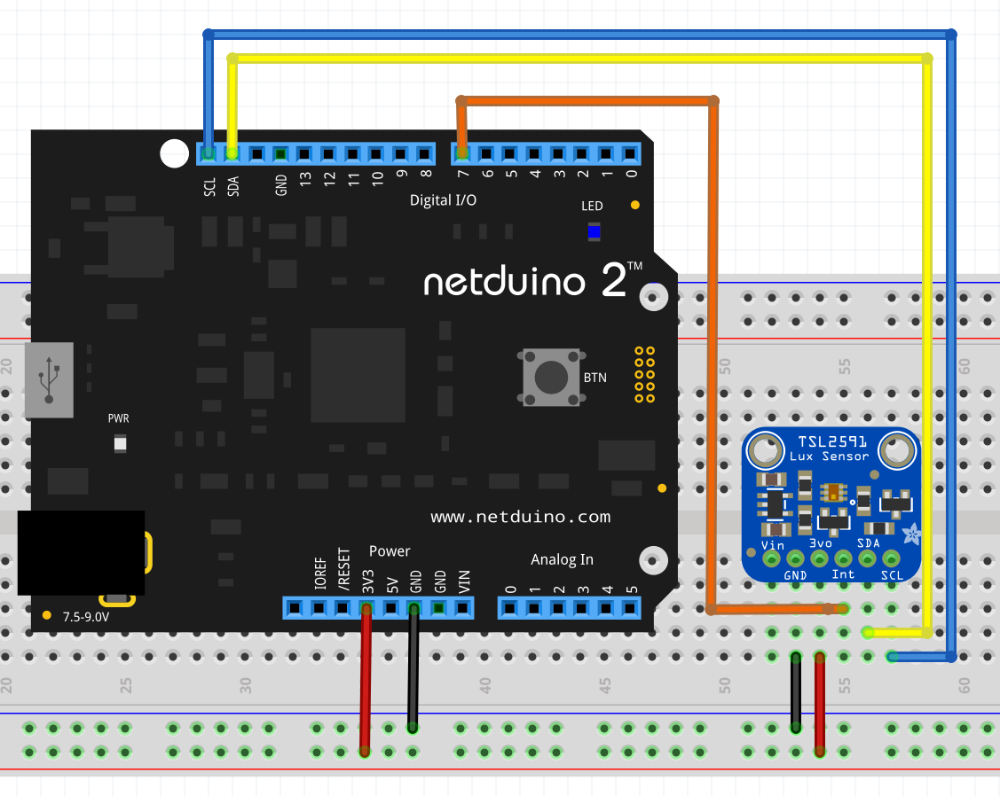

# TSL2561 Light Sensor

The TSL2561 is alight sensor that is compensated for the presence of infrared light.  This compensation allows for the reading to be closer to that experienced by the human eye.

An interrupt pin allows the sensor to generate an interrupt if the sensor reading goes below a lower threshold or exceeds an upper threshold.

The sensor is controlled and data read over the I2C bus.

## Purchasing

The TSL2561 is available as a breakout board from the following suppliers:

* [Adafruit](https://www.adafruit.com/product/439)
* [Sparkfun](https://www.sparkfun.com/products/12055)

## Hardware

The basic configuration of the TSL2561 requires only the data and power connections to be made:



Note that the connection between the `Int` pin and `D7` is only required when using the device in interrupt mode.

## Software

Applications using the TSL2561 can operating in two ways:

* Polled
* Interrupt driven

### Polling Application

A polled application will read the sensor whenever it needs access to a sensor reading.  The following application sets the sensor to high gain with an integration cycle of 402 milliseconds.  The sensor is then read every 2 seconds:

```csharp
using Microsoft.SPOT;
using Netduino.Foundation.Sensors.Light;
using System.Threading;
using SecretLabs.NETMF.Hardware.NetduinoPlus;

namespace TSL2561Example
{
    public class Program
    {
        static TSL2561 tsl2561 = new TSL2561();
        public static void Main()
        {
            Debug.Print("Polled TSL2561 Application.");
            Debug.Print("Device ID: " + tsl2561.ID.ToString());
            tsl2561.TurnOff();
            tsl2561.SensorGain = TSL2561.Gain.High;
            tsl2561.Timing = TSL2561.IntegrationTiming.Ms402;
            tsl2561.TurnOn();
            //
            //  Wait for at least one integration cycle (set to 402 milliseconds above).
            //
            Thread.Sleep(500);
            //
            //  Repeatedly read the light intensity.
            //
            while (true)
            {
                ushort[] adcData = tsl2561.SensorReading;
                Debug.Print("Data0: " + adcData[0].ToString() + ", Data1: " + adcData[1].ToString());
                Debug.Print("Light intensity: " + tsl2561.Lux.ToString());
                Thread.Sleep(2000);
            }
        }
    }
}
```
### Interrupt Driven Application

In the following application, a threshold window of 100 to 2000 is set.  An interrupt will be generated when the light reading on ADC Channel 0 falls below 100 or rises above 2000.  In a moderately lit room, covering the sensor will generate a reading below 100 and a low power torch will take the reading above 2000.

```csharp
using Microsoft.SPOT;
using Netduino.Foundation.Sensors.Light;
using System.Threading;
using SecretLabs.NETMF.Hardware.NetduinoPlus;

namespace TSL2561Example
{
    public class Program
    {
        static TSL2561 tsl2561 = new TSL2561();
        public static void Main()
        {
            Debug.Print("Testing the TSL2561 Class.");
            Debug.Print("Device ID: " + tsl2561.ID.ToString());
            //
            tsl2561.TurnOff();
            tsl2561.SensorGain = TSL2561.Gain.High;
            tsl2561.Timing = TSL2561.IntegrationTiming.Ms402;
            tsl2561.ThresholdLow = 100;
            tsl2561.ThresholdHigh = 2000;
            tsl2561.ReadingOutsideThresholdWindow += tsl2561_ReadingOutsideThresholdWindow;
            tsl2561.SetInterruptMode(TSL2561.InterruptMode.Enable, 1, Pins.GPIO_PIN_D7);
            tsl2561.TurnOn();
            Thread.Sleep(Timeout.Infinite);
        }

        /// <summary>
        /// The reading on the TSL2561 has moved outside of the threshold window.
        /// </summary>
        /// <param name="time">Time of the interrupt.</param>
        static void tsl2561_ReadingOutsideThresholdWindow(System.DateTime time)
        {
            ushort[] adcData = tsl2561.SensorReading;
            Debug.Print("Data0: " + adcData[0].ToString() + ", Data1: " + adcData[1].ToString());
            Debug.Print("Light intensity: " + tsl2561.Lux.ToString());
            tsl2561.ClearInterrupt();
        }
    }
}
```

# API

## Enums

### `Address`

The list of possible addresses for the TSL2561 sensor breakout board.

### `Gain`

The sensor gain can be either `Low` (x1) or `High` (x16).

###  `IntegrationTiming`

The sensor has three automatic modes and one manual mode.  The integration timing can be set to one of the following:

* 13.7 milliseconds
* 101 milliseconds
* 402 milliseconds
* Manual mode

### ` Registers`

The addresses of the registers in the TSL2561.

### `InterruptMode`

Allows interrupts to be enabled or disabled.

## Properties

### `SensorReading`

Raw data from the two ADCs, channel 0 and channel 1, on the sensor.

### `Lux`

Light intensity reading in lux.  The value returned will depend upon the timing and gain settings.

### `ID`

ID of the sensor.

### ` SensorGain`

Set the gain of the sensor to either `Low` or `High`.

### `Timing`

Integration timing for any sensor readings.

### `ThresholdLow` and `ThresholdHigh`

Set the lower and upper limits for the threshold window.  Readings outside of this window will generate an interrupt when interrupts are enabled.

## Methods

### `TurnOn` and `TurnOff`

These two methods turn the integration sensor on and off.  They can be used to put the sensor into low power mode.

### `ClearInterrupt`

Clear the interrupt flag in the sensor.

### `ManualStart` and `ManualStop`

Manually start or stop the integration sensor.

### `SetInterruptMode`

Setup the interrupt mode on the sensor.  The sensor can be configured to wait until a specified number of consecutive integration readings are outside of the threshold window before an interrupt is generated.

## Interrupts

### `ReadingOutsideThresholdWindow`

A `ReadingOutsideThresholdWindow` interrupt is generated when the reading on channel 0 has been outside of the threshold for the specified number of integration cycles.