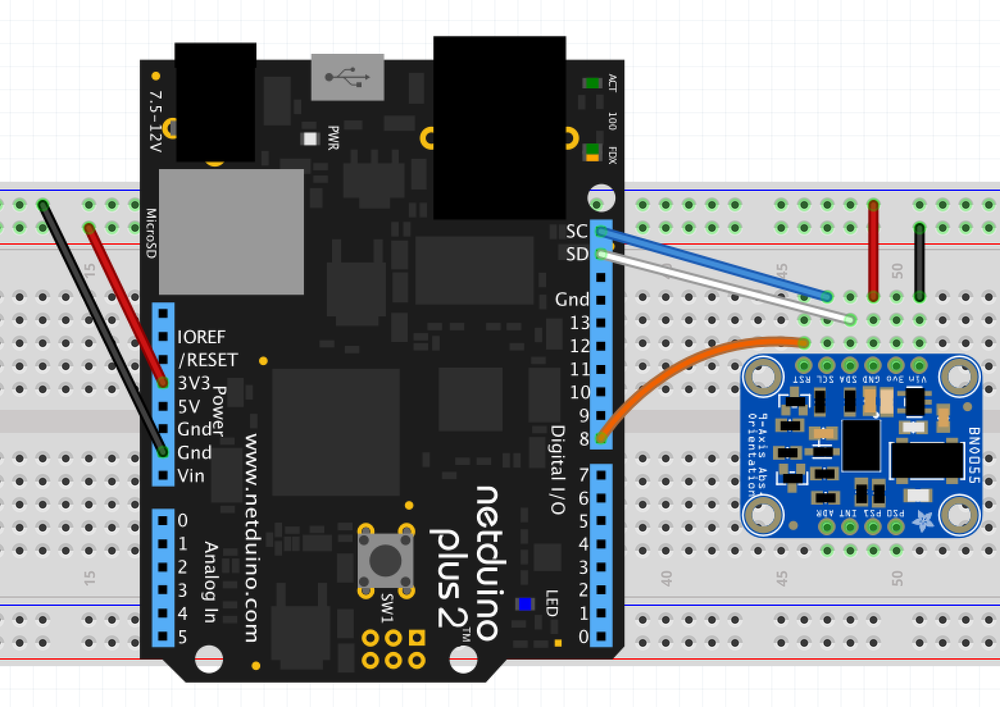

# BNO055 9-axis Orientation Sensor

BNO055 is a 9-axis absolute orientation sensor.  The three sensors (accelerometer, gyroscope and megnetometer) with a 32-bit cortex M0 microcontroller.

## Purchasing
* [Tindie BNO-055 9-axis motion sensor with fusion hardware](https://www.tindie.com/products/onehorse/bno-055-9-axis-motion-sensor-with-hardware-fusion/)

## Hardware

The following diagram shows the BNO055 configured for bas



## Software

The application below will send serial data to the [cuberotate](https://learn.adafruit.com/adafruit-bno055-absolute-orientation-sensor/downloads) application on the Adafruit web site.  Rotating the board will rotate the figure on the screen.

```csharp
using System.IO.Ports;
using System.Threading;
using Microsoft.SPOT;
using Microsoft.SPOT.Hardware;
using Netduino.Foundation.Sensors.Motion;
using System.Text;

namespace BNO055Test
{
    public class Program
    {
        /// <summary>
        ///     Pin used to reset the BNO055.
        /// </summary>
        private static OutputPort _resetPort = new OutputPort(Cpu.Pin.GPIO_Pin2, true);

        /// <summary>
        ///     Serial port used to send data to the computer.
        /// </summary>
        private static SerialPort _comPort = new SerialPort("COM1", 115200, Parity.None, 8, StopBits.One);

        /// <summary>
        ///     Convert a boolean value to text for the calibration messages.
        /// </summary>
        public static string BooleanToIntString(bool b)
        {
            return b ? "1" : "0";
        }

        /// <summary>
        ///     Write a message to the com port terminated with '\n'
        /// </summary>
        private static void WriteText(string text)
        {
            string message = text + "\n";
            _comPort.Write(Encoding.UTF8.GetBytes(message), 0, message.Length);
        }

        /// <summary>
        ///     Main program loop.
        /// </summary>
        public static void Main()
        {
            Debug.Print("BNO055 Test Application.");
            //
            _resetPort.Write(false);
            Thread.Sleep(10);
            _resetPort.Write(true);
            Thread.Sleep(50);
            //
            _comPort.Open();
            WriteText("Orientation Sensor Test");
            WriteText("");
            WriteText("Sensor:       BNO050");
            WriteText("Driver Ver:   1");
            WriteText("Unique ID:    ");
            WriteText("Max Value:    0.0");
            WriteText("Min Value:    0.0");
            WriteText("Resolution:   0.01");
            WriteText("");
            Thread.Sleep(500);
            //
            var bno055 = new BNO055(0x29);
            bno055.DisplayRegisters();
            bno055.PowerMode = BNO055.PowerModes.Normal;
            bno055.OperatingMode = BNO055.OperatingModes.ConfigurationMode;
            bno055.OperatingMode = BNO055.OperatingModes.InertialMeasurementUnit;
            bno055.DisplayRegisters();
            Debug.Print("Current temperature: " + bno055.Temperature.ToString("f2"));
            while (true)
            {
                bno055.Read();
                var reading = bno055.EulerOrientation;
                string orientationMessage = "Orientation: " + reading.Roll + " " + reading.Pitch + " " + reading.Heading;
                string calibrationMessage = "Calibration: " + BooleanToIntString(bno055.IsSystemCalibrated) + " " +
                            BooleanToIntString(bno055.IsGyroscopeCalibrated) + " " +
                            BooleanToIntString(bno055.IsAccelerometerCalibrated) + " " +
                            BooleanToIntString(bno055.IsMagnetometerCalibrated);
                Debug.Print(orientationMessage);
                Debug.Print(calibrationMessage);
                WriteText(orientationMessage);
                WriteText(calibrationMessage);
                Thread.Sleep(100);
            }
        }
    }
}
```

## API

### Enums

#### `enum ErrorCodes`

Error codes that can be generated by the sensor.

#### `enum SystemStatusCodes`

Sensor status codes.

#### `enum Units`

Units of measurement for the various sensors.

#### `enum Sensor`

Indicate which sensor can be used for an operation or which combination of sensors should be activated.

### Classes

#### `class SefTestResultMask`

Used to mask off the various self test status bits.

#### `class OperatingModes`

Various different sensor configurations.

#### `class PowerModes`

Three power modes are available:

* `LowPower`
* `Normal`
* `Suspended`

### Properties

#### `int Temperature`

Temperature of the sensor die in degrees centigrade.

#### `Sensor TemperatureSource`

Get or set which of the sensors is to be used in the measurement of the temperature.

#### `byte PowerMode`

Get or set the power mode of the sensor.  See `PowerModes` for the different modes that are available.

#### `byte OperatingMode`

Get or set the operating mode of the sensor (see the `OperatingModes` class).  A mode change takes between 9ms and 19ms.  This method takes a minimum of 20ms to execute.

#### `bool IsInFusionMode`

Indicate if the sensor is using one of the fusion modes.

#### `Vector AccelerometerReading`

Return the x, y abd z accelerometer readings as a `Vactor`.

`Read()` must be called before accessing this property.

#### `Vector MagnetometerReading`

Return the x, y and z magnetometer readings as a `Vector`.

`Read()` must be called before accessing this property.

#### `Vector GyroscopeReading`

Return the x, y and z gyroscope readings as a `Vector`.

`Read()` must be called before accessing this property.

#### `EulerAngles EulerOrientation`

Return the orientation as Euler Angles.  The sensor must be operating in fusion mode in order for a valid reading.

`Read()` must be called before accessing this property.

#### `Quaternion QuaterionOrientation`

Return the orientation as a quaternion.  The sensor must be operating in fusion mode in order for a valid reading.

`Read()` must be called before accessing this property.

#### `Vector LinearAcceleration`

Return the linear acceleration measurement as a `Vector`.  The sensor must be operating in fusion mode in order for a valid reading.

`Read()` must be called before accessing this property.

#### `Vector GravityVector`

Retrieve the gravity measurement as a `Vector`.  The sensor must be in fusion mode in order for the reading to be valid.

`Read()` must be called before accessing this property.

#### `bool IsSystemCalibrated`, `bool IsAccelerometerCalibrated`, `bool IsGyroscopeCalibrated`, `bool IsMagnetometerCalibrated`

Indicate if the system, gyroscope, magnetometer or accelerometer are calibrated.

#### `bool IsFullyCalibrated`

Indicate if the sensor is fully calibrated (all of `IsSystemCalibrated`, `IsAccelerometerCalibrated`, `IsGyroscopeCalibrated`, `IsMagnetometerCalibrated` are true).

### Constructors

#### `BNO055(byte address = 0x28, ushort speed = 400)`

Create a new `BNO055` object.

### Methods

#### `void Read()`

Read the sensor data registers from the sensor.  This method should be called before any of the properties relating to position, orientation etc are accessed.

#### `void DisplayRegisters()`

Read all of the registers in Page 0 of the sensor and display the registers in the debug console.