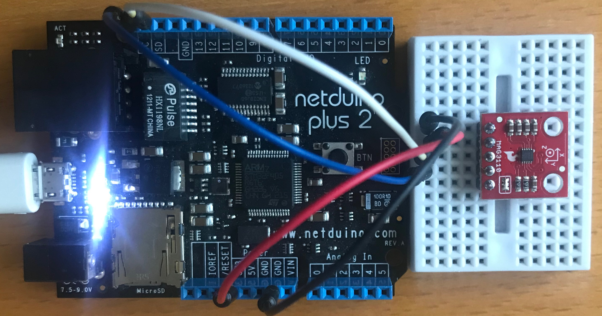

# MAG3110 - Triple Axis Digital Magnetometer

The MAG3110 is a three axis magnetometer with an I2C interface.  The magnetometer is capable of single shot readings and also continuous readings.

## Hardware

In it's basic configuration the magnetometer requires four connections:

| Netduino Pin | Sensor Pin     | Wire Color |
|--------------|----------------|------------|
| 3.3V         | V<sub>cc</sub> | Red        |
| GND          | GND            | Black      |
| SC           | SCK            | Blue       |
| SD           | SDA            | White      |
| D8           | INT1           | Not shown  |



## Software

The following application reads the values from the magnetometer and displays the readings on the debug output:

```csharp
using Microsoft.SPOT;
using Netduino.Foundation.Sensors.Motion;
using System.Threading;

namespace MAG3110Test
{
    public class Program
    {
        public static void Main()
        {
            Debug.Print("MAG3110 Test Application");
            MAG3110 mag3110 = new MAG3110();
            mag3110.Standby = false;
            int readingCount = 0;
            while (true)
            {
                mag3110.Read();
                readingCount++;
                Debug.Print("Reading " + readingCount.ToString() + ": x = " + mag3110.X.ToString() + ", y = " + mag3110.Y.ToString() + ", z = " + mag3110.Z.ToString());
                Thread.Sleep(1000);
            }
        }
    }
}
```
This library also supports interrupts when the sensor completes a reading:

```csharp
using Microsoft.SPOT;
using Netduino.Foundation.Sensors.Motion;
using SecretLabs.NETMF.Hardware.NetduinoPlus;
using System.Threading;

namespace MAG3110Test
{
    public class Program
    {
        public static void Main()
        {
            Debug.Print("MAG3110 Test Application");
            MAG3110 mag3110 = new MAG3110(0x0e, 400, Pins.GPIO_PIN_D8);
            mag3110.OnReadingComplete += mag3110_OnReadingComplete;
            mag3110.InterruptsEnabled = true;
            mag3110.Standby = false;
            Thread.Sleep(Timeout.Infinite);
        }

        /// <summary>
        /// Catch the data ready interrupt and display the data.
        /// </summary>
        /// <param name="sensorReading">SensorReadings structure containing the X, Y and X values.</param>
        static void mag3110_OnReadingComplete(MAG3110.SensorReading sensorReading)
        {
            Debug.Print("Reading: x = " + sensorReading.X.ToString() + ", y = " + sensorReading.Y.ToString() + ", z = " + sensorReading.Z.ToString());
        }
    }
}
```

## API

This library supports polling and interrupts

### Structures

#### `SensorReading`

This structure is used to pass sensor readings to the interrupt handler.  The structure holds the `X`, `Y` and `Z` sensor readings.

See the `OnReadingComplete` interrupt.

### Constructors

#### `MAG3110(byte address = 0x0e, ushort speed = 400)`

Create a new `MAG3110` object using the default settings as specified in the datasheet.

### Properties

#### `X`, `Y` and `Z`

Magnetometer readings for the x, y and z axes.  These three properties are only valid when `Read` has been called.

#### `Standby`

Set or retrieve the `Standby` state for the sensor.  The following puts the sensor into standby mode.

```csharp
Standby = true;
```

### Methods

#### `Reset()`

Put the sensor into standby mode and reset the sensor control and offset registers.

#### `Read()`

Read sensor values from the magnetometer and set the `X`, `Y` and `Z` properties.

### Interrupt Handlers

#### `OnReadingComplete`

Generated when the DR Status register indicates that the sensor has completed a reading and the data is available.  The sensor readings are passed to the interrupt handler through a `SensorReading` structure.