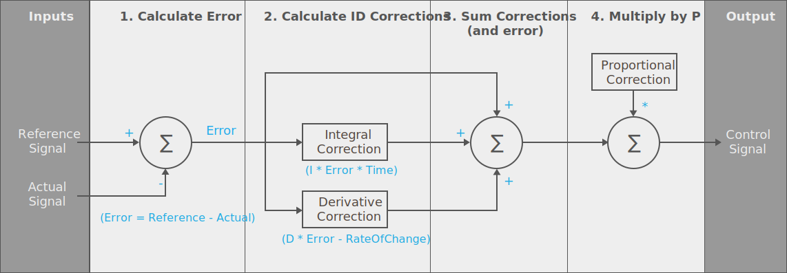

# Info

PID is the quintessential industrial control algorithm. It is a mathematical tool for efficiently affecting change in a system to get it to a particular target state, and keeping it there, harmoniously.

It’s the algorithm that keeps drones balanced in the air, your car at the right speed when cruise control is on, and ships on the right heading with variable winds. It’s also the algorithm that can efficiently heat a cup of coffee to the perfect temperature and keep it there

`StandardPIDController` implements the most common version of the PID algorithm, which tends to be more generally applicable than the _ideal_ calculation. The standard version of PID is discussed on the [Wikipedia PID article](https://en.wikipedia.org/wiki/PID_controller#Ideal_versus_standard_PID_form). 

The following block diagram describes the calculation using the standard algorithm:



In the standard form, step 3 produces a single error value that uses both the integral to account for past errors and the derivative which can predict future error based on rate of change. This single error correction is then scaled (multiplied) by the proportional error constant.

For a detailed discussion and explanation of the PID algorithm, see the Wilderness Labs [PID Guide](http://developer.wildernesslabs.co/Hardware/Reference/Algorithms/Proportional_Integral_Derivative/).

# API

## Properties

#### float ProportionalComponent { get; set; }

The _gain_ value to use when calculating the proportional corrective action. A good value to start with when tuning is `1.0`.

#### float IntegralComponent { get; set; }

In the standard PID algorithm, the derivative gain is specified in `time in minutes` to zero, or target state. A good value to start with when tuning is `0.1`.

#### float DerivativeComponent { get; set; }

In the standard PID algorithm, the derivative gain is specified in `time in minutes` to zero, or target state. As with the ideal form, the derivative should only be used when the `ActualInput` value has very little noise, as the derivative uses the slope of change to calculate the corrective action. A good value to start with when tuning is `0.001`.

#### float OutputMax { get; set; }

The maximum allowable control output value. The control output is clamped to this value after being calculated via the `CalculateControlOutput` method.

#### float OutputMin { get; set; }

The minimum allowable control output value. The control output is clamped to this value after being calculated via the `CalculateControlOutput` method.

#### bool OutputTuningInformation { get; set; }

Whether or not to print the calculation information to the output console in an comma-delimited form. Useful for  pasting into a spreadsheet to graph the system control  performance when tuning the PID controller corrective action gains.

Output format is:

```
[output descriptor],[target],[input],[proportional action],[integral action],[derivative action],[calculated control output]
```

#### float ActualInput { get; set; }

Represents the _Process Variable_ (PV), or the actual signal reading of the system in its current state. For example, when heating a cup of coffee to `75º`, if the temp sensor says the coffee is currently at `40º`, the `40º` is the actual input value.

#### float TargetInput { get; set; }

Represents the _set point_ (SP), or the reference target signal to achieve. For example, when heating a cup of coffee to `75º`, `75º` is the target input value.

## Methods

#### void ResetIntegrator()

Resets the integrator error history. 

#### float CalculateControlOutput()

Calculates the control output based on the difference (error) between the `ActualInput` and `TargetInput`, using the supplied `ProportionalComponent`, `IntegralComponent`, and `DerivativeComponent`.