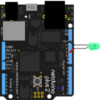

# Info

Represents an LED whose voltage is limited by the duty-cycle of a PWM signal.

# Example

The following example pulses an LED between 15% brightness to 100% brightness.

## Code

```csharp
using N = SecretLabs.NETMF.Hardware.Netduino;
using System.Threading;

namespace Netduino.Foundation.Core.Samples
{
    public class Program
    {
        public static void Main()
        {
            // create a new pwm controlled LED on pin 11
            var pwmLed = new LEDs.PwmLed(N.PWMChannels.PWM_PIN_D11,
             LEDs.TypicalForwardVoltage.Green);

            // pulse the LED by taking the brightness from 15% too 100% and 
            // back again.
            float brightness = 0.15F;
            bool ascending = true;
            float change = 0;
            while (true)
            {
                if (brightness <= 0.15)
                {
                    ascending = true;
                }
                else if (brightness == 1)
                {
                    ascending = false;
                }
                change = (ascending) ? 0.1F : -0.1F;
                brightness += change;

                //float error clamp
                if (brightness < 0) { brightness = 0; }
                else if (brightness > 1) { brightness = 1; }

                pwmLed.Brightness = brightness;

                // for very fast, try 20
                Thread.Sleep(50);

            }
        }
    }
}
```

## Circuit



# API Reference

## Constructors

### `public PwmLed(H.Cpu.PWMChannel pin, float forwardVoltage)`

Creates a new PwmLed on the specified PWM pin and limited to the appropriate  voltage based on the passed `forwardVoltage`. Typical LED forward voltages can be found in the [`TypicalForwardVoltage`](../TypicalForwardVoltage/) class.

## Properties

### `public float Brightness { get; set; }`

The brightness of the LED, controlled by a PWM signal, and limited by the calculated maximum voltage. Valid values are from 0 to 1, inclusive.

Therefore, specifying `0.5` would set the LED to 50% brightness.

## Methods

### `public void StartBlink(int onDuration = 200, int offDuration = 200, float highBrightness = 1, float lowBrightness = 0)`

Start the Blink animation which sets the brightness of the LED alternating between a low and high brightness setting, using the durations provided.

### `public void StartPulse(int pulseDuration = 600, float highBrightness = 1, float lowBrightness = 0.15F)`

Start the Pulse animation which gradually alternates the brightness of the LED between a low and high brightness setting, using the durations provided.

### `public void Stop()`

Stops any running animations.