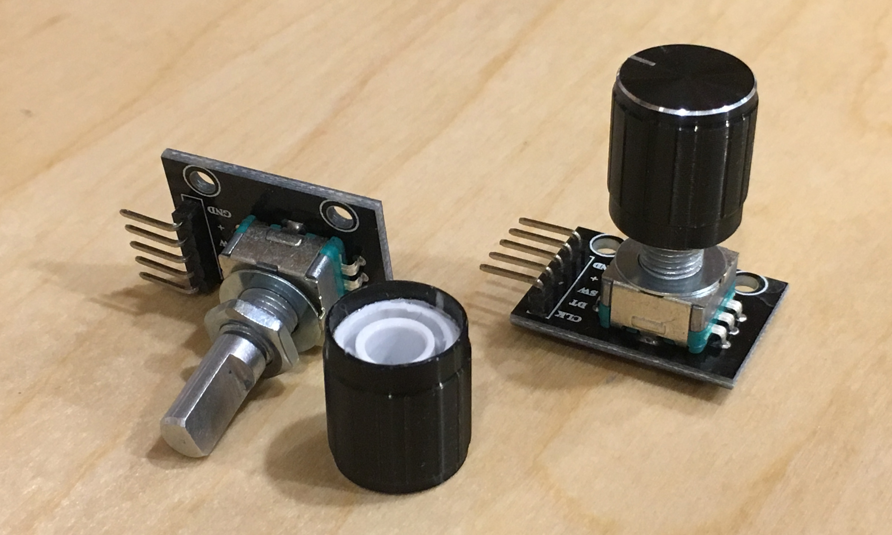

# Info

Rotary encoders are similar in form factor to potentiometers, but instead of modifying a voltage output, they send a digital signal encoded using [Gray Code](https://en.wikipedia.org/wiki/Gray_code) when rotated that can be decoded to ascertain the direction of turn. 

Rotary encoders have several advantages over potentiometers as input devices, namely:

 * They're more power efficient; they only use power when actuated.
 * They're not rotation-bound; they spin infinitely in either direction.
 * Many rotary encoders also have a built-in pushbutton.

Rotary encoders are used almost exclusively on things like volume knobs on stereos.

And because they're not rotation bound, they are especially useful in the case in which a device might have multiple inputs to control the same parameter. For instance, a stereo's volume might be controlled via a knob and a remote control. If a potentiometer were used for the volume knob, then the actual volume could get out of synch with the apparent value on the potentiometer when the volume was changed via the remote.

For this reason, rotary encoders are particularly useful in connected things, in which parameters might be controlled remotely.

# API

## Events

### `RotaryTurnedEventHandler Rotated`

Raised when the rotary encoder is rotated and returns a [`RotaryTurnedEventArgs`](/API/Sensors/Rotary/RotaryTurnedEventArgs) object which describes the direction of rotation.

## Properties

#### `H.InterruptPort APhasePin { get; }`

Returns the pin connected to the A-phase output on the rotary encoder.

#### `H.InterruptPort BPhasePin { get; }`

Returns the pin connected to the B-phase output on the rotary encoder.

