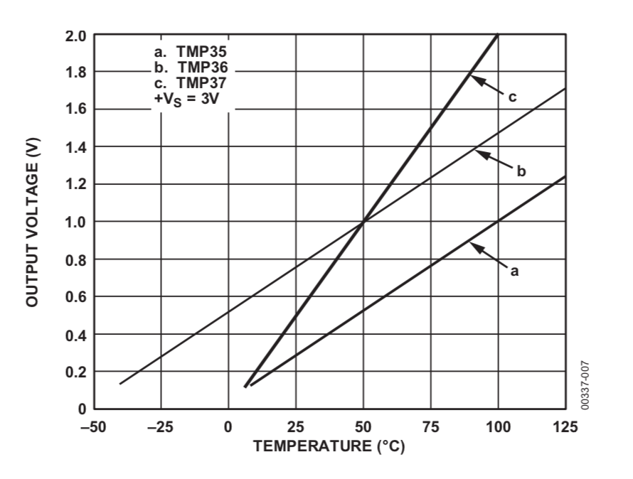
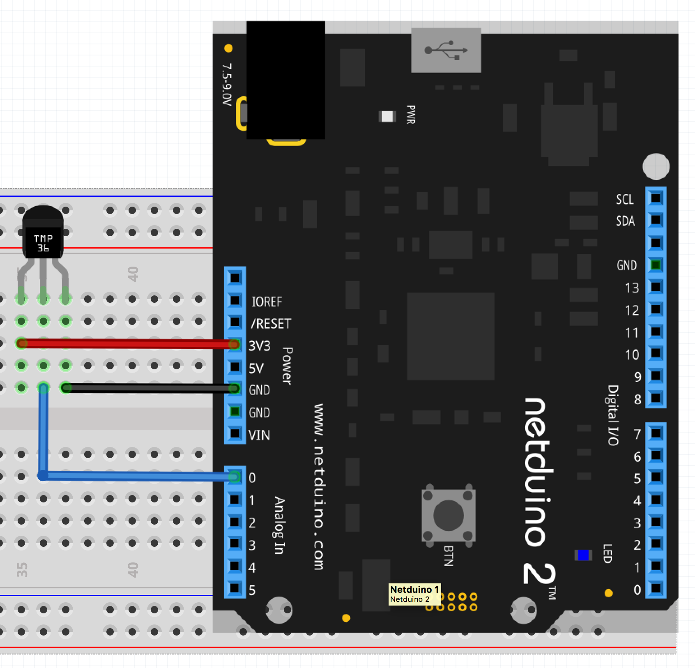

The analog temperature sensor driver can be used with any sensor that has a linear voltage response. It has been tested with the following series of temperature sensors:

* TMP35
* TMP36
* TMP37
* LM35

These sensors exhibit a linear change in the analog voltage for each degree centigrade.  This is often presented in the datasheet as follows:



This driver should work with any sensor of this type.

## Purchasing

TMP36 sensors can be purchased from a number of suppliers including:

* [Adafruit](https://www.adafruit.com/product/165)
* [Sparkfun](https://www.sparkfun.com/products/10988)

## Hardware

Consider the TMP36, this sensor requires only three connections; power, ground and the analog output:



## Using

The `AnalogTemperature` sensor driver has two modes of operation:

* Interrupt/Event Notifications (default)
* Polled

### Interrupt/Event Notification Mode

By default, the `AnalogTemperature` sensor driver operates in a high level notification mode, in which the driver automatically polls the sensor at a specified interval and will raise a `TemperatureChanged` event when the sensor's input changes by a specified amount. 

The `TemperatureChanged` event contains a [`SensorFloatEventArgs`](/API/Sensors/SensorFloatEventArgs/) which exposes both a `CurrentValue` property, and a `LastNotifiedValue` property.

#### Sample Code

The following application demonstrates how to use the TMP36 in interrupt mode.  The sensor will be read every second and changes in values greater than +/- 0.1C will generate and interrupt:

```csharp
using System.Threading;
using Microsoft.SPOT;
using Netduino.Foundation.Sensors.Temperature;
using SecretLabs.NETMF.Hardware.NetduinoPlus;

namespace AnalogTemperatureInterruptSample
{
    /// <summary>
    ///     Illustrate how to read the TMP36 temperature sensor in interrupt mode.
    /// </summary>
    public class Program
    {
        public static void Main()
        {
            Debug.Print("Read TMP36");
            //
            //  Create a new TMP36 object to check the temperature every 1s and
            //  to report any changes greater than +/- 0.1C.
            //
            var tmp36 = new AnalogTemperature(AnalogChannels.ANALOG_PIN_A0,
                AnalogTemperature.SensorType.TMP36, updateInterval: 1000,
                temperatureChangeNotificationThreshold: 0.1F);
            //
            //  Connect an interrupt handler.
            //
            tmp36.TemperatureChanged += (s, e) =>
            {
                Debug.Print("Temperature: " + e.CurrentValue.ToString("f2"));
            };
            //
            //  Now put the application to sleep as the data is processed
            //  by the interrupt handler above.
            //
            Thread.Sleep(Timeout.Infinite);
        }
    }
}
```

### Polled Mode

In polled mode, the application is responsible for requesting that the `Temperature` property is updated with the current reading.

The sensor is placed into polling mode by setting the `updateInterval` parameter in the constructor to `0`.

#### Sample Application

The following application polls the sensor five seconds and prints the temperature reading to the debug console:

```csharp
using System.Threading;
using Microsoft.SPOT;
using Netduino.Foundation.Sensors.Temperature;
using SecretLabs.NETMF.Hardware.NetduinoPlus;

namespace AnalogTemperaturePollingSample
{
    /// <summary>
    ///     Illustrate how to read the TMP36 temperature sensor (polling mode).
    /// </summary>
    public class Program
    {
        public static void Main()
        {
            Debug.Print("Read TMP36");
            var tmp36 = new AnalogTemperature(AnalogChannels.ANALOG_PIN_A0,
                                              AnalogTemperature.SensorType.TMP36,
                                              updateInterval: 0);
            //
            //  Now read the sensor every 5 seconds.
            //
            while (true)
            {
                tmp36.Update();
                Debug.Print("Reading: " + tmp35.Temperature.ToString("f2"));
                Thread.Sleep(5000);
            }
        }
    }
}
```

## API

### Local Classes

#### [`Calibration`](Calibration/)

The local `Calibration` class allows the `AnalogTemperature` sensor to be configured for any sensor that exhibits linear changes in the output voltage as temperature changes.

See the [`Calibration` documentation](Calibration/) for more information.

### Constants

#### `const ushort MinimumPollingPeriod = 100`

This constant defines the minimum interrupt polling period (in interrupt mode) for the sensor.

### Enums

#### `KnownSensorType`

A number of temperature sensors are predefined and support natively by the `AnalogTemperature` class.  The natively supported sensors can be found in the `KnownSensorType` enum:

```csharp
enum SensorType { Custom, TMP35, TMP36, TMP37, LM35, LM45, LM50 };
```

### Constructor

#### `AnalogTemperature(Cpu.AnalogChannel analogPin, KnownSensorType sensorType, Calibration calibration = null, ushort updateInterval = MINIMUM_POLLING_PERIOD, float temperatureChangeNotificationThreshold = 0.001F)`

An `AnalogTemperature` object can be constructed in a number of ways:

* Using one of the built in sensor types (TMP35, TMP36 etc.)
* User defined analog sensor

#### Built-in Temperature Sensors

A new instance of a supported sensor can be constructed  by supplying the sensor type and the analog pin that the sensor is connected to:

```csharp
var tmp36 = new AnalogTemperature(AnalogChannels.ANALOG_PIN_A0, AnalogTemperature.KnownSensorType.TMP36);
```

#### User Defined Temperature Sensor

A new sensor can be supported using the `KnownSensorType.Custom` sensor type.  The application provides a `Calibration` object to correctly configure the `AnalogTemperature` object.

For example, when creating a new custom sensor, valid values to describe that sensor might be:

* `10` millivolts (mV) per degree centigrade
* `250` millivolts (mV) output at `25`ºC

The code for creating an `AnalogTemperature` object for this sensor when connected to pin `A0` would then be:

```csharp
var calibration = new AnalogTemperature.Calibration(25, 250, 20);
var newSensor = new AnalogTemperature(AnalogChannels.ANALOG_PIN_A0, KnownSensorType.Custom, calibration);
```

#### `updateInterval` and `temperatureChangeNotificationThreshold`

When operating in interrupt mode, the `updateInterval` value defines the frequency in which the sensor is updated.  Any differences between the last reported value and the current value that exceed the `temperatureChangeNotificationThreshold` value will raise an event notification.

### Properties

#### `Temperature { get; private set; }`

The `Temperature` property takes a reading from the sensor and returns the result in degrees centigrade.

Example:

```csharp
currentTemperature = AnalogTemperature.Temperature;
```

### Methods

#### `void Update()`

Update the `Temperature` property with the current sensor reading.

Note that this method does not need to be called when the sensor is operating in interrupt mode.

### Events

#### `event SensorFloatEventHandler TemperatureChanged`

A `TemperatureChanged` event is generated when the difference between the last reading and the current reading is greater than +/- `temperatureChangeNotificationThreshold`.  The event will return the last reading and the current reading (see [`SensorFloatEventArgs`](/API/Sensors/SensorFloatEventArgs)).