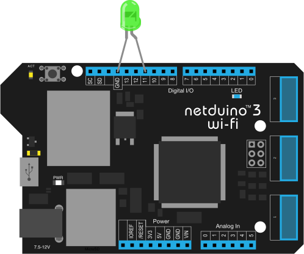

# Hello, World!

1. [Configure your Netduino development environment](http://developer.wildernesslabs.co/Netduino/Getting_Started/).
2. Create a new .NET MicroFramework console application.
3. `Install-Package Netduino.Foundation` (Detailed Nuget instructions: [Mac](https://docs.microsoft.com/en-us/visualstudio/mac/nuget-walkthrough), [Windows](https://docs.microsoft.com/en-us/nuget/tools/package-manager-ui)).
4. Plug the longer leg (cathode) of a green LED into pin `11` and the other leg into `GND`:


5. Add the following code to the `program.cs` file in your application, then deploy and run:
 
```csharp
using N = SecretLabs.NETMF.Hardware.Netduino;
using System.Threading;

namespace Netduino.Foundation.Core.Samples
{
    public class HelloWorldProgram
    {
        public static void Main()
        {
            // create a new LED on pin 11
            var pwmLed = new LEDs.PwmLed(N.PWMChannels.PWM_PIN_D11, 
                LEDs.TypicalForwardVoltage.Green);

            // pulse the LED
            pwmLed.StartPulse();

            // keep the app running
            Thread.Sleep(Timeout.Infinite);
        }
    }
}
```

That's it, and you're up and running using Netduino.Foundation!

Next up, check out how to work with sensors; which comprise a huge portion of the Netduino.Foundation [peripheral library](/Library).

## [Next - Working with Sensors](Working_with_Sensors)