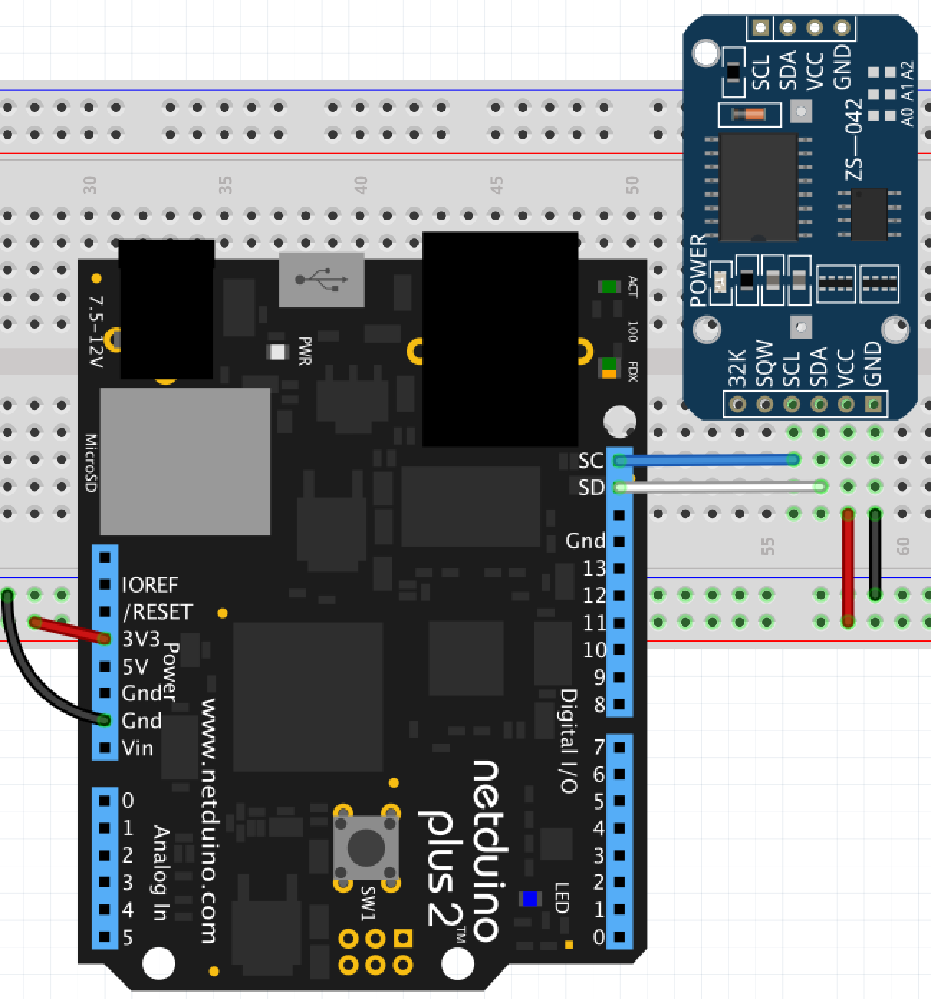

The AT24Cxx series of chips provide a mechanism for storing data that will survive a power outage or battery failure.  These EEPROMs are available in varying sizes and are accessible using the I2C interface.

## Hardware

The chip used to develop this library is one that is available on a common DS3231 RTC module with EEPROM memory module:

* [DS3231 with integrated EEPROM](https://www.amazon.com/s/ref=nb_sb_noss?url=search-alias%3Daps&field-keywords=ds3231)



## Software

The following software displays the first 16 bytes of the EEPROM, writes values to those bytes and then displays the new contents:

```csharp
using System.Threading;
using Microsoft.SPOT;
using Netduino.Foundation.EEPROM;

namespace AT24C32Test
{
    public class Program
    {
        public static void Main()
        {
            var eeprom = new AT24Cxx(0x57);
            var memory = eeprom.Read(0, 16);
            for (ushort index = 0; index < 16; index++)
            {
                Debug.Print("Byte: " + index + ", Value: " + memory[index]);
            }
            eeprom.Write(3, new byte[] { 10 });
            eeprom.Write(7, new byte[] { 1, 2, 3, 4 });
            memory = eeprom.Read(0, 16);
            for (ushort index = 0; index < 16; index++)
            {
                Debug.Print("Byte: " + index + ", Value: " + memory[index]);
            }
            Thread.Sleep(Timeout.Infinite);
        }
    }
}
```

## API

### Constructors

#### `AT24Cxx(byte address = 0x50, ushort speed = 10, ushort pageSize = 32, ushort memorySize = 8192)`

Creates a new AT24Cxx object with the specified address, communication speed, memory size and page size.

The `pageSize` is the number of bytes that can be written in a single transaction before the address pointer wraps to the start of the page.  This value is used to assist with higher performance data writes.

The `memorySize` parameter is the number of bytes in the EEPROM.  This is used to prevent wrapping from the end of the EEPROM back to the start.

### Methods

#### `byte[] Read(ushort startAddress, ushort amount)`

The `Read` method will read a number of bytes (`amount`)from the specified `address`.

#### `void Write(ushort startAddress, byte[] data)`

The `Write` method writes a number of bytes to the EEPROM.