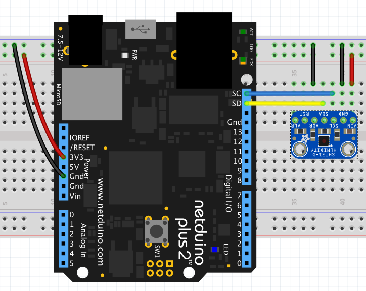

The SHT31D is a temperature and humidity sensor with a built in I2C interface.  The sensor has a typical accuracy of +/- 2% relative humidity and +/- 0.3C.

## Hardware



The SHT31D breakout board from Adafruit is supplied with pull-up resistors installed on the `SCL` and `SDA` lines.

The `ADR` line is tied low giving and I2C address of 0x44.  This address line can also be tied high and in this case the I2C address is 0x45.

## Purchasing

The SHT31D temperature and humidity is available on a breakout board from Adafruit:

* [SHT31D Temperature and Humidity Sensor](https://www.adafruit.com/product/2857)

## Software

The SHT31D can operate in interrupt or polling mode.  The default mode is interrupt mode.

#### Interrupt Mode

The application below generates and interrupt when the temperature or humidity changes by more than 0.1 &deg;C.  The sensor is checked every 100 milliseconds.

```csharp
using System.Threading;
using Microsoft.SPOT;
using Netduino.Foundation.Sensors.Atmospheric;

namespace SHT31DInterruptSample
{
    /// <summary>
    ///     Illustrate the use of the SHT31D operating in interrupt mode.
    /// </summary>
    public class Program
    {
        public static void Main()
        {
            //
            //  Create a new SHT31D object that will generate interrupts when
            //  the temperature changes by more than +/- 0.1C or the humidity
            //  changes by more than 1%.
            //
            SHT31D sht31d = new SHT31D(temperatureChangeNotificationThreshold: 0.1F,
                humidityChangeNotificationThreshold: 1.0F);
            //
            //  Hook up the two interrupt handlers to display the changes in
            //  temperature and humidity.
            //
            sht31d.HumidityChanged += (s, e) =>
            {
                Debug.Print("Current humidity: " + e.CurrentValue.ToString("f2"));
            };

            sht31d.TemperatureChanged += (s, e) =>
            {
                Debug.Print("Current temperature: " + e.CurrentValue.ToString("f2"));
            };
            //
            //  Main program loop can now go to sleep as the work
            //  is being performed by the interrupt handlers.
            //
            Thread.Sleep(Timeout.Infinite);
        }
    }
}
```

#### Polling Mode

The application below polls the sensor every 1000 milliseconds and displays the temperature and humidity on the debug console:

```csharp
using Microsoft.SPOT;
using Netduino.Foundation.Sensors.Atmospheric;
using System.Threading;

namespace SHT31DPollingSample
{
    public class Program
    {
        public static void Main()
        {
            SHT31D sht31d = new SHT31D(updateInterval: 0);

            Debug.Print("SHT31D Temperature / Humidity Test");
            while (true)
            {
                sht31d.Update();
                Debug.Print("Temperature: " + sht31d.Temperature.ToString("f2") + ", Humidity: " + sht31d.Humidity.ToString("f2"));
                Thread.Sleep(1000);
            }
        }
    }
}
```

## API

### Constants

#### `public const ushort MinimumPollingPeriod = 100`

Minimum value for the `updateInterval` property in the constructor.  This represents the minimum number of milliseconds between sensor samples when operating in interrupt mode.

### Constructor

#### `public SHT31D(byte address = 0x44, ushort speed = 100, ushort updateInterval = MinimumPollingPeriod, float humidityChangeNotificationThreshold = 0.001F, float temperatureChangeNotificationThreshold = 0.001F)`

Create a new SHT31D temperature and humidity sensor object.  The address defaults to 0x44 and the speed of the I2C bus to 100 Khz.

In interrupt mode, the `updateInterval` defines the number of milliseconds between samples.  By default, this is set to the `MinimumPollingPeriod` and this places the sensor in interrupt mode.  Setting the `updateInterval` to 0 milliseconds places the sensor in polling mode.

`humidityChangeNotificationThreshold` and `temperatureChangeNotificationThreshold` define the thresholds for the interrupts (events).  Any changes in the temperature and humidity readings that exceed the respective thresholds will generate the appropriate event.

### Properties

#### `float Temperature`

Retrieve the last read temperature.  In polling mode, the `Temperature` property is only valid after a call to `Update`.  In interrupt mode the `Temperature` property will be updated periodically.

#### `public float TemperatureChangeNotificationThreshold { get; set; } = 0.001F`

Threshold for the `TemperatureChanged` event.  Differences between the last notified value and the current value which exceed + / - `TemperateChangedNotificationThreshold` will generate an interrupt.

#### `float Humidity`

Retrieve the last read humidity.  In polling mode, the `Humidity` property is only valid after a call to `Update`.  In interrupt mode the `Humidity` property will be updated periodically.

#### `public float HumidityChangeNotificationThreshold { get; set; } = 0.001F`

Threshold for the `HumidityChanged` event.  Differences between the last notified value and the current value which exceed + / - `HumidityChangedNotificationThreshold` will generate an interrupt.

### Methods

#### `void Update()`

The `Read` method forces a temperature and humidity reading from the SHT31D temperature and humidity sensor.  The reading is made using high repeatability mode.

### Events

#### `event SensorFloatEventHandler TemperatureChanged`

A `TemperatureChanged` event is raised when the difference between the current and last temperature readings exceed +/- `temperatureChangeNotificationThreshold`.  The event will return the last reading and the current reading (see [`SensorFloatEventArgs`](/API/Sensors/SensorFloatEventArgs)).

#### `event SensorFloatEventHandler HumidityChanged`

A `HumidityChanged` event is raised when the difference between the current and last humidity readings exceed +/- `humidityChangeNotificationThreshold`.  The event will return the last reading and the current reading (see [`SensorFloatEventArgs`](/API/Sensors/SensorFloatEventArgs)).