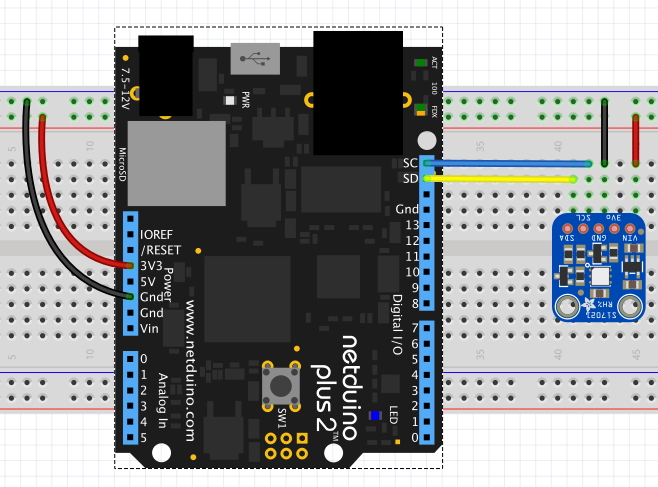

The Si7021 is a small temperature and humidity sensor with an I2C interface.

## Purchasing

The Si7021 is available on a breakout board from the the following suppliers:

* [Adafruit Si7021 Breakout Board](https://www.adafruit.com/product/3251)
* [Sparkfun Si7021 Breakout Board](https://www.sparkfun.com/products/13763)
* [Tessel Climate Module](https://www.seeedstudio.com/Tessel-Climate-Module-p-2225.html)

Note that the Tessel Climate module is compatible with this library.

## Hardware



Both the Sparkfun and Adafruit boards have pull-up resistors already installed on the breakout boards and so these are not required to use the sensor.

## Software

The SI7021 can operate is a polling or interrupt mode.  The default operation is interrupt mode.

### Interrupt Mode

The following sample demonstrates how to put the SI7021 sensor into interrupt mode.  The sensor will generate an interrupt every 100 ms (default setting for the polling period).

```csharp
using System.Threading;
using Microsoft.SPOT;
using Netduino.Foundation.Sensors.Atmospheric;

namespace Si7021Test
{
    public class Program
    {
        public static void Main()
        {
            Debug.Print("SI7021 Interrupt Example");
            var si7021 = new SI7021(updateInterval: 2000);
            Debug.Print("Serial number: " + si7021.SerialNumber);
            Debug.Print("Firmware revision: " + si7021.FirmwareRevision);
            Debug.Print("Sensor type: " + si7021.SensorType);
            si7021.TemperatureChanged += (s, e) =>
            {
                Debug.Print("Temperature changed to: " + si7021.Temperature.ToString("f2"));
            };
            Thread.Sleep(Timeout.Infinite);
        }
    }
}
```

### Polling Mode

The following application reads a number of static properties from the sensor (`SerialNumber` etc.).  The current temperature and humidity are then read once a second and displayed through the debugger interface:

```csharp
using System.Threading;
using Microsoft.SPOT;
using Netduino.Foundation.Sensors.Atmospheric;

namespace Si7021Test
{
    public class Program
    {
        public static void Main()
        {
            Debug.Print("SI7021 Polling Example");
            var si7021 = new SI7021(updateInterval: 0);
            Debug.Print("Serial number: " + si7021.SerialNumber);
            Debug.Print("Firmware revision: " + si7021.FirmwareRevision);
            Debug.Print("Sensor type: " + si7021.SensorType);
            while (true)
            {
                Debug.Print("Temperature: " + si7021.Temperature.ToString("f2"));
                Thread.Sleep(1000);
            }
        }
    }
}
```

## API

### Constants

#### `const ushort MinimumPollingPeriod = 100`

Minimum value for the `updateInterval` property in the constructor.  This represents the minimum number of milliseconds between sensor samples when operating in interrupt mode.

### Enums

#### `DeviceType`

Possible types of sensor.

| Code              | Description        |
|-------------------|--------------------|
| Unknown           | Unknown sensor     |
| Si7013            | Si7013             |
| Si7020            | Si7020             |
| Si7021            | Si7021             |
| EngineeringSample | Engineering sample |

### Constructors

#### `public SI7021(byte address = 0x40, ushort speed = 100, ushort updateInterval = MinimumPollingPeriod, float humidityChangeNotificationThreshold = 0.001F, float temperatureChangeNotificationThreshold = 0.001F)`

Create a new SI7021 object using the default configuration.

In interrupt mode, the `updateInterval` defines the number of milliseconds between samples.  By default, this is set to the `MinimumPollingPeriod` and this places the sensor in interrupt mode.  Setting the `updateInterval` to 0 milliseconds places the sensor in polling mode.

`humidityChangeNotificationThreshold` and `temperatureChangeNotificationThreshold` define the thresholds for the interrupts (events).  Any changes in the temperature and humidity readings that exceed the respective thresholds will generate the appropriate event.

### Properties

#### `float Temperature`

Retrieve the last read temperature.  In polling mode, the `Temperature` property is only valid after a call to `Update`.  In interrupt mode the `Temperature` property will be updated periodically.

#### `public float TemperatureChangeNotificationThreshold { get; set; } = 0.001F`

Threshold for the `TemperatureChanged` event.  Differences between the last notified value and the current value which exceed + / - `TemperateChangedNotificationThreshold` will generate an interrupt.

#### `float Humidity`

Retrieve the last read humidity.  In polling mode, the `Humidity` property is only valid after a call to `Update`.  In interrupt mode the `Humidity` property will be updated periodically.

#### `public float HumidityChangeNotificationThreshold { get; set; } = 0.001F`

Threshold for the `HumidityChanged` event.  Differences between the last notified value and the current value which exceed + / - `HumidityChangedNotificationThreshold` will generate an interrupt.

#### `ulong SerialNumber`

The serial number from the sensor.

#### `DeviceType SensorType`

Type of sensor attached to the Netduino.

#### `byte FirmwareRevision`

Firmware revision number as read from the sensor.

#### `byte Resolution`

Resolution of the sensor:

| Sensor Code | Temperature Resolution | Humidity Resolution |
|-------------|------------------------|---------------------|
| 0           | 14 bit                 | 14 bit              |
| 1           | 12 bit                 | 8 bit               |
| 2           | 13 bit                 | 10 bit              |
| 3           | 11 bit                 | 11 bit              |

### Methods

#### `void Update()`

Read the current humidity and temperature from the sensor.

#### `void Reset()`

Perform a soft reset and then read the humidity and temperature from the sensor.

#### `void Heater(bool onOrOff)`

Turn the heater on (`true`) or off (`false`).

### Events

#### `event SensorFloatEventHandler TemperatureChanged`

A `TemperatureChanged` event is raised when the difference between the current and last temperature readings exceed +/- `temperatureChangeNotificationThreshold`.  The event will return the last reading and the current reading (see [`SensorFloatEventArgs`](/API/Sensors/SensorFloatEventArgs)).

#### `event SensorFloatEventHandler HumidityChanged`

A `HumidityChanged` event is raised when the difference between the current and last humidity readings exceed +/- `humidityChangeNotificationThreshold`.  The event will return the last reading and the current reading (see [`SensorFloatEventArgs`](/API/Sensors/SensorFloatEventArgs)).