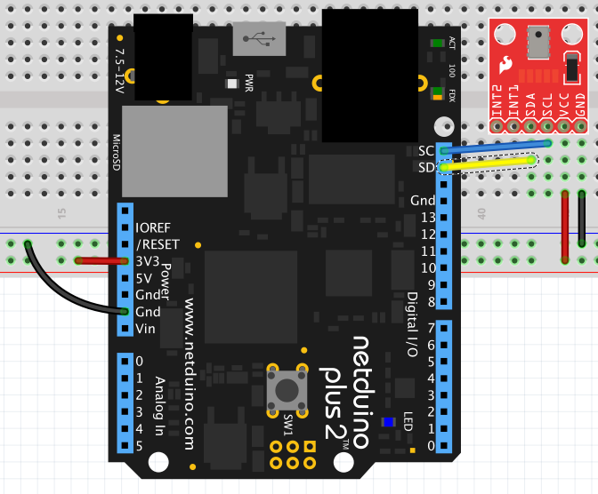

The MPL3115A2 is a barometric pressure sensor capable of reading both temperature and temperature compensated pressure reading.  This sensor includes the following features:

* I2C digital interface
* 24-bit ADC
* Altitude and pressure measurements
* Temperature sensor

## Purchasing

The MPL3115A2 is available on breakout boards and a weather shield:

* [Adafruit MPL3115A2 Breakout Board](https://www.adafruit.com/product/1893)
* [Sparkfun MPL3115A2 Breakout Board](https://www.sparkfun.com/products/11084)
* [Sparkfun Weather Shield](https://www.sparkfun.com/products/13956)

## Hardware

MPL3115A2 configured for polling more data reads:



## Software

### Interrupt Mode

The application below connects the MPL115A2 to two interrupt handlers.  These interrupt handlers (events) will display the `Temperature` and `Pressure` properties when the handlers are triggered.  The sensor is checked every 100 milliseconds (the default for the `updatePeriod`).

```csharp
using System.Threading;
using Microsoft.SPOT;
using Netduino.Foundation.Sensors.Barometric;

namespace MPL3115A2InterruptSample
{
    public class Program
    {
        public static void Main()
        {
            Debug.Print("MPL3115A2 Interrupt Example");
            var mpl3115a2 = new MPL3115A2(temperatureChangeNotificationThreshold: 0.1F);
            mpl3115a2.TemperatureChanged += (s, e) =>
            {
                Debug.Print("Temperature: " + mpl3115a2.Temperature.ToString("f2"));
            };
            mpl3115a2.PressureChanged += (s, e) =>
            {
                Debug.Print("Pressure: " + mpl3115a2.Pressure.ToString("f2")); 
            };
            Thread.Sleep(Timeout.Infinite);
        }
    }
}
```

### Polling Mode

The following application reads the temperature and pressure every second and displays the result on the debug console:

```csharp
using System.Threading;
using Microsoft.SPOT;
using Netduino.Foundation.Sensors.Barometric;

namespace MPL3115A2Test
{
    public class Program
    {
        public static void Main()
        {
            Debug.Print("MPL3115A2 Polling Example");
            var mpl3115a2 = new MPL3115A2(updateInterval: 0);
            while (true)
            {
                mpl3115a2.Update();
                Debug.Print("Temperature: " + mpl3115a2.Temperature.ToString("f2") + ", Pressure: " +
                            mpl3115a2.Pressure.ToString("f2"));
                Thread.Sleep(1000);
            }
        }
    }
}
```

## API

### Constants

#### `const ushort MinimumPollingPeriod = 150`

Minimum value for the `updateInterval` property in the constructor.  This represents the minimum number of milliseconds between sensor samples when operating in interrupt mode.

### Constructors

#### `MPL3115A2(byte address = 0x60, ushort speed = 400, ushort updateInterval = MinimumPollingPeriod, float temperatureChangeNotificationThreshold = 0.001F, float pressureChangedNotificationThreshold = 10.0F)`

Create a new `MPL3115A2` object with the default `I2C` address and bus speed.

In interrupt mode, the `updateInterval` defines the number of milliseconds between samples.  By default, this is set to the `MinimumPollingPeriod` and this places the sensor in interrupt mode.  Setting the `updateInterval` to 0 milliseconds places the sensor in polling mode.

`pressureChangeNotificationThreshold` and `temperatureChangeNotificationThreshold` define the thresholds for the interrupts (events).  Any changes in the temperature and pressure readings that exceed the respective thresholds will generate the appropriate event.

### Properties

#### `float Temperature`

Retrieve the last read temperature.  In polling mode, the `Temperature` property is only valid after a call to `Update`.  In interrupt mode the `Temperature` property will be updated periodically.

#### `public float TemperatureChangeNotificationThreshold { get; set; } = 0.001F`

Threshold for the `TemperatureChanged` event.  Differences between the last notified value and the current value which exceed + / - `TemperateChangedNotificationThreshold` will generate an interrupt.

#### `float Pressure`

Retrieve the last read pressure in Pascals.  In polling mode, the `Pressure` property is only valid after a call to `Update`.  In interrupt mode the `Pressure` property will be updated periodically.

#### `public float PressureChangeNotificationThreshold { get; set; } = 0.001F`

Threshold for the `PressureChanged` event.  Differences between the last notified value and the current value which exceed + / - `PressureChangedNotificationThreshold` will generate an interrupt.

#### `bool Standby`

Get or set the standby status of the sensor.

Note that calling the `Read` method will take the sensor out of standby mode.

### Methods

#### `void Update()`

Read the current temperature and pressure from the sensor and set the `Temperature` and `Pressure` properties.

#### `void Reset()`

Reset the sensor.

### Events

#### `event SensorFloatEventHandler TemperatureChanged`

A `TemperatureChanged` event is raised when the difference between the current and last temperature readings exceed +/- `temperatureChangeNotificationThreshold`.  The event will return the last reading and the current reading (see [`SensorFloatEventArgs`](/API/Sensors/SensorFloatEventArgs)).

#### `event SensorFloatEventHandler PressureChanged`

A `PressureChanged` event is raised when the difference between the current and last pressure readings exceed +/- `pressureChangedNotificationThreshold`.  The event will return the last reading and the current reading (see [`SensorFloatEventArgs`](/API/Sensors/SensorFloatEventArgs)).