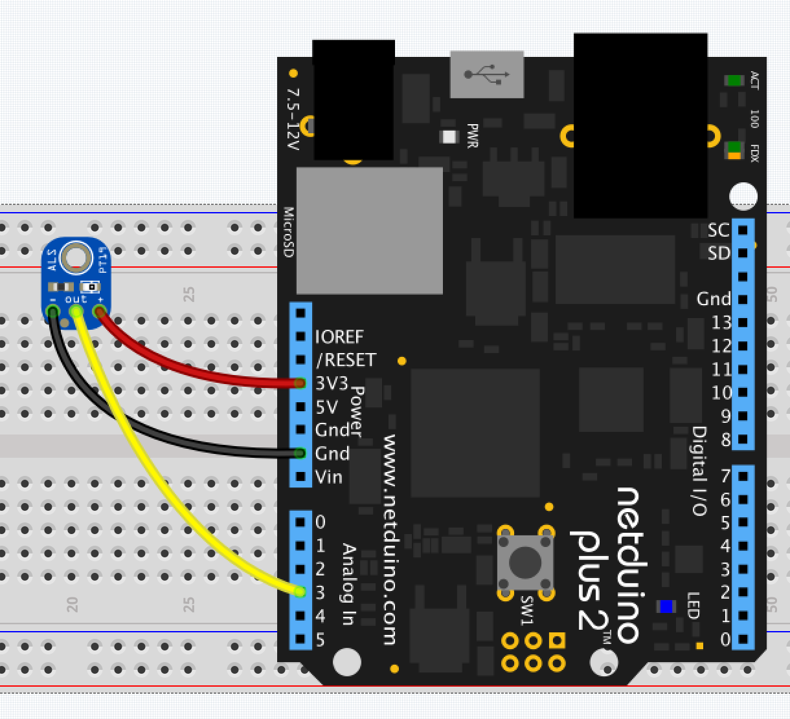

# ALS-PT19 - Light Sensor

This library and documentation is currently under development.

## Purchasing

The ALS-PT19 senors are available on breakout boards and as individual sensors:

* [Adafruit breakout board](https://www.adafruit.com/product/2748)
* [Sparkfun ALS-PT19 Sensor](https://www.proto-pic.co.uk/als-pt19-light-sensor.html)
* [Sparkfun Weather Shield](https://www.proto-pic.co.uk/weather-shield.html)

## Hardware

The ALS-PT19C is a simple analog device requiring only three connections:



## Software

The following application reads the sensor output voltage once per scond and outputs the result on the debugger console:

```csharp
using System.Threading;
using Microsoft.SPOT;
using Microsoft.SPOT.Hardware;
using Netduino.Fountation.Sensors.Light;

namespace ALSPT19315CTest
{
    public class Program
    {
        public static void Main()
        {
            Debug.Print("ALSPT19315C Test");
            var sensor = new ALSPT19315C(Cpu.AnalogChannel.ANALOG_1, 3.3);
            while (true)
            {
                Debug.Print("Sensor reading: " + sensor.Voltage.ToString("f2"));
                Thread.Sleep(1000);
            }
        }
    }
}
```

## API

### Constructors

#### `ALSPT19315C(Cpu.AnalogChannel sensorChannel, double referenceVoltage)`

Create a new light sensor object where the sensor output is connected to `sensorChannel`.  The sensor will use an assumed fixed `referenceVoltage` in order to calculate the sensor output voltage.

#### `ALSPT19315C(Cpu.AnalogChannel sensorChannel, Cpu.AnalogChannel referenceVoltageChannel)`

Create a new light sensor object where the sensor output is connected to `sensorChannel`.  The sensor will read the reference voltage from the `referenceVoltageChannel` analog input pin each time a measurement is made.

### Properties

#### `double Voltage`

Read the voltage output from the sensor.