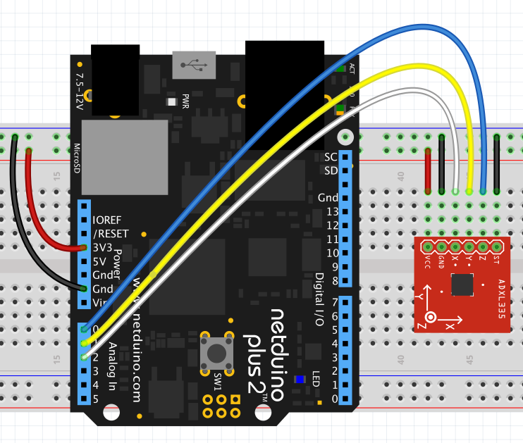

# ADXL335 - Triple Axis Accelerometer

The ADXL335 is a low power accelerometer capable of measuring +/- 3g of acceleration along three axes.

## Purchasing

The ADXL335 sensor can be purchased on a breakout board from the following suppliers:

* [Adafruit ADXL335](https://www.adafruit.com/product/163)
* [Sparkfun ADXL335](https://www.sparkfun.com/products/9269)

## Hardware



The datasheet notes that bypass capacitors should be installed for the X, Y and Z outputs from the sensor.  Both the Sparkfun and Adafruit breakout boards have `0.1uF` capacitors installed on the board.

## Software

The ADXL335 can operate in interrupt and polling mode.

### Interrupt Mode

The example below uses the default setting to check the sensor every 100 milliseconds.  The sensor will generate and interrupt if the acceleration changes by more than 0.1g:

```csharp
using System.Threading;
using Microsoft.SPOT;
using Netduino.Foundation.Sensors.Motion;
using SecretLabs.NETMF.Hardware.NetduinoPlus;

namespace ADXL335InterruptSample
{
    public class Program
    {
        public static void Main()
        {
            var adxl335 = new ADXL335(AnalogChannels.ANALOG_PIN_A0, AnalogChannels.ANALOG_PIN_A1, AnalogChannels.ANALOG_PIN_A2);
            adxl335.SupplyVoltage = 3.3;
            adxl335.XVoltsPerG = 0.343;
            adxl335.YVoltsPerG = 0.287;
            adxl335.ZVoltsPerG = 0.541;
            //
            //  Attach an interrupt handler.
            //
            adxl335.AccelerationChanged += (s, e) =>
            {
                var rawData = adxl335.GetRawSensorData();
                Debug.Print("\n");
                Debug.Print("X: " + adxl335.X.ToString("F2") + ", " + rawData.X.ToString("F2"));
                Debug.Print("Y: " + adxl335.Y.ToString("F2") + ", " + rawData.Y.ToString("F2"));
                Debug.Print("Z: " + adxl335.Z.ToString("F2") + ", " + rawData.Z.ToString("F2"));
            };
            //
            //  Netduino can now go to sleep as the data will be processed
            //  by the interrupt handler.
            //
            Thread.Sleep(Timeout.Infinite);
        }
    }
}
```

### Polling Mode

The following code will set up the sensor and display the G force and raw sensor data every 250 milliseconds:

```csharp
using System.Threading;
using Microsoft.SPOT;
using SecretLabs.NETMF.Hardware.NetduinoPlus;
using Netduino.Foundation.Sensors.Motion;

namespace ADXL335Test
{
    public class Program
    {
        public static void Main()
        {
            ADXL335 adxl335 = new ADXL335(AnalogChannels.ANALOG_PIN_A0, AnalogChannels.ANALOG_PIN_A1, AnalogChannels.ANALOG_PIN_A2);
            adxl335.SupplyVoltage = 3.3;
            adxl335.XVoltsPerG = 0.343;
            adxl335.YVoltsPerG = 0.287;
            adxl335.ZVoltsPerG = 0.541;
            while (true)
            {
                ADXL335.Readings acceleration = adxl335.GetAcceleration();
                ADXL335.Readings rawData = adxl335.GetRawSensorData();

                Debug.Print("\n");
                Debug.Print("X: " + acceleration.X.ToString("F2") + ", " + rawData.X.ToString("F2"));
                Debug.Print("Y: " + acceleration.Y.ToString("F2") + ", " + rawData.Y.ToString("F2"));
                Debug.Print("Z: " + acceleration.Z.ToString("F2") + ", " + rawData.Z.ToString("F2"));
                Thread.Sleep(250);
            }
        }
    }
}
```

## API

### Constants

#### `const ushort MinimumPollingPeriod = 100`

Minimum number of milliseconds that can be used for the `updatePeriod`.

### Constructor

#### `ADXL335(Cpu.AnalogChannel x, Cpu.AnalogChannel y, Cpu.AnalogChannel z, ushort updateInterval = 100, double accelerationChangeNotificationThreshold = 0.1F)`

The constructor takes three `Cpu.AnalogChannel` inputs, one for each axis.  The specified channels will be attached to the respective X, Y, and Z readings.

`updateInterval` determines if the sensor is to operate in interrupt or polling mode.  A value of 0 will put the sensor into interrupt mode.  A value other than 0 will set the update period (in milliseconds).

In interrupt mode, any changes in acceleration greater than + / - `accelerationChangeNotificationThreshold` will generate and interrupt.

### Properties

#### `double SupplyVoltage`

This property holds the supply voltage for the sensor.  By default this will be set to 3.3V when the constructor is executed.  This value will be used to determine the centre point (0g) for the sensor.

#### `XVoltsPerG`, `YVoltsPerG`, `ZVoltsPerG`

These three properties hold the voltage change that will be expected for each 1g of acceleration the sensor experiences.

These are set to the default values from the data sheet (X: 0.325, Y: 0.325, Z: 0.550).  These values should be set in the application following calibration.

#### `AccelerationChangeNotificationThreshold`

In interrupt mode, this sensor checks the sensor reading periodically.  `AccelerationChangeNotificationThreshold` is used to determine if the checking method should generate an interrupt (see `AccelerationChanged`).

### Methods

#### `Vector GetAcceleration()`

Get a `Vector` structure holding the acceleration for the X, Y and Z axes.  This method uses the `SupplyVoltage`, `XVoltsPerG`, `YVoltsPerG` and `ZVoltsPerG` properties to determine the current acceleration being experienced.

#### `void GetRawSensorData()`

This method returns a `Vector` structure that holds the data from the analog inputs for each of the X, Y and Z axes.  These values are in the range 0-1.

### Events

#### `AccelerationChanged`

This event is generated if the difference between the last reported acceleration and the current acceleration reading on any of the x, y or z axes is greater then + / - `AccelerationChangeNotificationThreshold`.