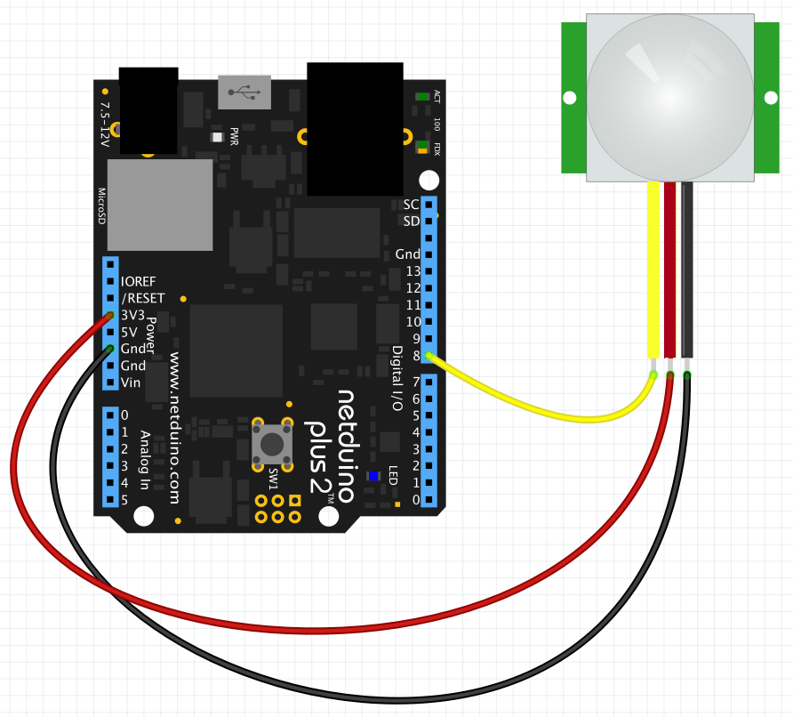

# Parallax PIR

The Parallax PIR detects motion by emitting a high signal when motion is detected.  The signal returns to a low state when motion stops.

## Purchasing

The parallax PIR sensor is available from Parallax Inc:

* [Parallax PIR Rev B](https://www.parallax.com/product/555-28027)

## Hardware

The Parallax PIR sensor requires only three connections, power, ground and motion detection signal:



## Software

The following application creates a `ParallaxPIR` object and attaches interrupt handlers to the `OnMotionStart` and `OnMotionEnd` events:

```csharp
using Microsoft.SPOT;
using Netduino.Foundation.Sensors.Motion;
using SecretLabs.NETMF.Hardware.NetduinoPlus;
using System.Threading;

namespace ParallaxPIRTest
{
    public class Program
    {
        public static void Main()
        {
            ParallaxPIR pir = new ParallaxPIR(Pins.GPIO_PIN_D8);

            pir.OnMotionStart += pir_OnMotionStart;
            pir.OnMotionEnd += pir_OnMotionEnd;
            Thread.Sleep(Timeout.Infinite);
        }

        static void pir_OnMotionEnd(object sender)
        {
            Debug.Print("Motion stopped.");
        }

        static void pir_OnMotionStart(object sender)
        {
            Debug.Print("Motion detected.");
        }
    }
}
```

## API

### Constructors

#### `ParallaxPIR(Cpu.Pin interruptPin)`

Create a new `ParallaxPIR` object with the sensor output connected to the `interruptPin`.

### Events

#### `OnMotionStart` and `OnMotionEnd`

These events are raised when motion is detected `OnMotionStart` and when it stops `OnMotionEnd`.