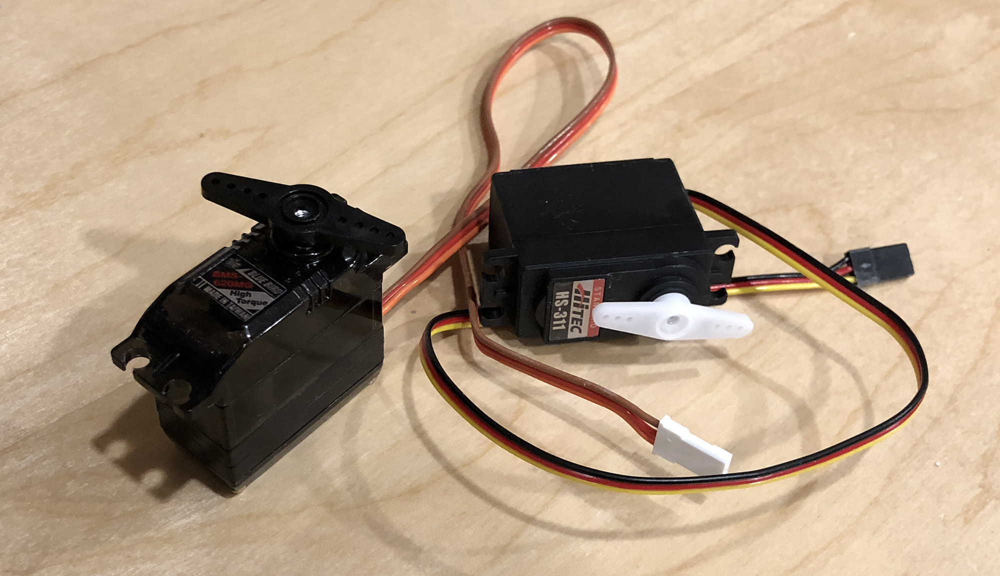

# Info

The Netduino.Foundation ServoCore framework simplifies command and control of _servomotors_ (more commonly known as _servos_).

[motors with gears to give them more torque]

[common in radio controlled hobbies]



[controlled by a PWM signal]

[minimum pulse width = 0º]
[maximum pulse width = maximum angle]

## Types of Servos

[regular servos and continuous rotation servos]

## Powering Servos

[should be hooked up to an external power supply, as they can draw a lot of current]

## Circuit


### Cable Colors

[colors vary by manufacturer]

| Pin | Signal  | Futaba Colors | HiTec Colors    | JR Colors |
|-----|---------|---------------|-----------------|-----------|
| 1   | GND     | Black         | Black           | Brown     |
| 2   | VCC     | Red           | Red or Brown    | Red       |
| 3   | Control | White         | Yellow or White | Orange    |

## Code Examples

### Standard Fixed Rotation Servo

```csharp
using Microsoft.SPOT;
using Netduino.Foundation;
using Netduino.Foundation.Sensors.Buttons;
using Netduino.Foundation.Servos;
using System.Threading;
using H = Microsoft.SPOT.Hardware;
using N = SecretLabs.NETMF.Hardware.Netduino;


namespace ServoSample
{
    public class Program
    {
        static IServo _servo = null;
        static PushButton _button = null;

        public static void Main()
        {
            _servo = new Servo(N.PWMChannels.PWM_PIN_D9, NamedServoConfigs.BlueBirdBMS120);
            _button = new PushButton((H.Cpu.Pin)0x15, CircuitTerminationType.Floating);

            _button.Clicked += (object sender, Microsoft.SPOT.EventArgs e) =>
            {
                Debug.Print("Button Clicked");
                ToggleServo();
            };

            Thread.Sleep(Timeout.Infinite);
        }

        static void ToggleServo()
        {
            if (_servo.Angle == _servo.Config.MinimumAngle)
            {
                Debug.Print("Rotating to " + _servo.Config.MaximumAngle.ToString());
                _servo.RotateTo(_servo.Config.MaximumAngle);
            }
            else
            {
                Debug.Print("Rotating to " + _servo.Config.MinimumAngle.ToString());
                _servo.RotateTo(_servo.Config.MinimumAngle);
            }
        }
    }
}
```

### Continuous Rotation Servo

```csharp
using Microsoft.SPOT;
using Netduino.Foundation;
using Netduino.Foundation.Sensors.Buttons;
using Netduino.Foundation.Servos;
using System.Threading;
using H = Microsoft.SPOT.Hardware;
using N = SecretLabs.NETMF.Hardware.Netduino;


namespace ContinuousRotationServoSample

{
    public class Program
    {
        static ContinuousRotationServo _servo = null;
        static PushButton _button = null;
        static bool _running = false;

        public static void Main()
        {
            _servo = new ContinuousRotationServo(N.PWMChannels.PWM_PIN_D9, NamedServoConfigs.IdealContinuousRotationServo);
            _button = new PushButton((H.Cpu.Pin)0x15, CircuitTerminationType.Floating);

            _button.Clicked += (object sender, Microsoft.SPOT.EventArgs e) =>
            {
                Debug.Print("Button Clicked");
                ToggleServo();
            };

            Thread.Sleep(Timeout.Infinite);
        }

        static void ToggleServo()
        {
            if (!_running)
            {
                Thread th = new Thread(() => {
                    _running = true;
                    while (_running)
                    {
                        Debug.Print("Rotating clockwise at increasing speeds.");
                        for (float speed = 1; speed <= 10; speed++)
                        {
                            if (!_running) break;
                            _servo.Rotate(Direction.Clockwise, (speed / 10.0f));
                            Thread.Sleep(500);
                        }

                        if (!_running) break;
                        Debug.Print("Stopping for half a sec.");
                        _servo.Stop();
                        Thread.Sleep(500);

                        Debug.Print("Rotating counter-clockwise at increasing speeds.");
                        for (float speed = 1; speed <= 10; speed++)
                        {
                            if (!_running) break;
                            _servo.Rotate(Direction.CounterClockwise, (speed / 10.0f));
                            Thread.Sleep(500);
                        }
                    }
                });
                th.Start();
            } else {
                Debug.Print("Stopping.");
                _running = false;
                Thread.Sleep(550); // wait for the loop to break
                _servo.Stop();
            }
        }
    }
}
```

## Interfaces

* **[`IServo`](/Library/ServoCore/IServo)** - The base interface for all fixed rotation servos.
* **[`IContinuousRotationServo`](/Library/ServoCore/IContinuousRotationServo)** - The base class for all continuous rotation servos.

## Base Classes

* **[`ServoBase'](/Library/ServoCore/ServoBase)** - Base class for IServo implementations.

## Classes

* **[`Servo`](/Library/ServoCore/Servo)** - Class for controlling standard fixed rotation servos.
* **[`ContinuousRotationServo`](/Library/ServoCore/ContinuousRotationServo)** - Class for controlling standard continuous rotation servos.
* **[`ServoConfig`](/Library/ServoCore/ServoConfig`)** - Configuration class describing the parameters of standard servos.
* **[`NamedServoConfigs`](/Library/ServoCore/NamedServoConfigs)** - A set of known servo configurations.

